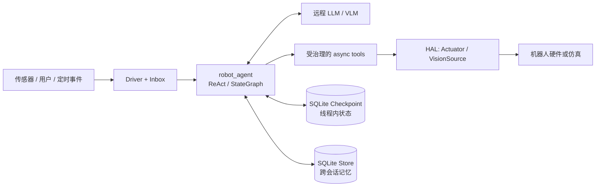

<div align="center">
  <h1>嵌入式机器人 Agent 底座</h1>
  <p>面向嵌入式 Linux 的长时运行机器人 Agent：能思考、行动、记忆、自主推进目标，并在物理副作用发生前接受安全治理。</p>
</div>

本项目从 [LangGraph](https://github.com/langchain-ai/langgraph) 官方 monorepo 裁剪而来，保留本地 Agent
运行所需的图执行、checkpoint、store 和 prebuilt 能力，在其上实现了 `robot_agent/` 应用层。
目标不是提供又一个通用聊天机器人框架，而是提供一套依赖可控、离线可测、状态可恢复、适合嵌入机器人进程的 Agent 运行底座。

LLM 推理默认通过远程 API 完成；图执行、状态、记忆、安全门控和硬件调用均留在本地。开发和回归测试可使用
Mock LLM、Mock HAL 与临时 SQLite 完全离线运行。

## 核心能力

- **思考 → 决策 → 行动 → 记忆**：基于 `create_react_agent` 组装模型、工具、状态和记忆，所有硬件副作用统一经过 async 工具。
- **可恢复的本地状态**：SQLite checkpoint 按 `thread_id` 保存会话执行状态，进程重启后可继续；store 保存跨会话事实、经历和偏好。
- **长会话管理**：上下文达到高水位后增量摘要已完成的旧回合，保留近期原文；摘要失败时不覆盖原消息和既有摘要。
- **硬件抽象层（HAL）**：核心只依赖 `SensorSource` / `Actuator` Protocol；内置 Mock 实现可记录动作并回放感知，真实 SDK 隔离在插件层。
- **可靠性与物理安全**：模型重试、超时与保守降级；高速运动和抓取可在执行前通过 `interrupt` 暂停确认，非法命令 fail-closed。
- **自主运行**：常驻 Driver、优先级收件箱、空闲策略、目标分解与仲裁，使 Agent 能响应事件并在空闲时推进目标。
- **记忆与成长**：稳定身份锚点、回合复盘、episodic → facts/prefs 蒸馏、记忆去重/冲突消解/衰减，以及可持久化的技能库。
- **治理与可观测**：工具权限、限幅、限频、审计日志、循环/预算检测、决策日记、离线 replay 和健康度汇总。
- **内置视觉入口**：通过 `VisionSource` 把不透明 `image_ref` 交给 VLM；原图不进入消息或 checkpoint，并在推理前限制尺寸与编码质量。

## 架构



仓库分为两层：

```text
robot_agent/                   应用层：机器人 Agent 的策略、自治、治理与运维
├── graph.py                   Agent 装配入口 build_robot_agent()
├── llm.py                     fast / smart / vision / mock 模型工厂
├── state.py                   消息、摘要与只读世界状态
├── context.py + memory.py     中短期上下文与长期记忆
├── hal/ + tools.py            硬件接口、Mock 实现与动作工具
├── driver/ + goals/           常驻循环、事件收件箱与目标系统
├── safety.py + governance/    危险动作门控、权限、限幅、限频与审计
├── identity.py + reflect/     身份、经历记录与复盘蒸馏
├── metacog/ + skills/         自我监控与数据化技能
├── vision/ + ops/             视觉入口、决策日记与健康度
└── prompts/                   集中管理的 LLM 可见提示词

libs/                          裁剪后的 LangGraph 被动框架
├── checkpoint                记忆接口与内存实现
├── checkpoint-sqlite         SQLite checkpoint / store
├── prebuilt                  create_react_agent / ToolNode
└── langgraph                 StateGraph / Pregel / channels / stream
```

核心库依赖关系为 `checkpoint → {checkpoint-sqlite, prebuilt, langgraph}`、`prebuilt → langgraph`。
上游 CLI、Server SDK、RemoteGraph、Postgres checkpoint 等非嵌入式运行必需链路已移除。

## 快速开始

### 1. 安装

要求 Python 3.10+ 和 [uv](https://docs.astral.sh/uv/)。

```bash
uv venv
source .venv/bin/activate
uv pip install -r requirements-app.txt
uv pip install -e libs/checkpoint -e libs/checkpoint-sqlite -e libs/prebuilt -e libs/langgraph
```

也可以使用：

```bash
make install
source .venv/bin/activate
```

### 2. 离线跑通最小闭环

下面的示例不访问网络，也不控制真实硬件。脚本化模型发起 `move_to` 工具调用，Mock 执行器把命令记录在 `.log` 中。

```python
import asyncio

from langchain_core.messages import AIMessage, HumanMessage

from robot_agent import build_effectors, build_robot_agent, make_model


async def main() -> None:
    effectors = build_effectors("mock")
    model = make_model(
        "mock",
        responses=[
            AIMessage(
                content="",
                tool_calls=[{
                    "name": "move_to",
                    "args": {"x": 1.0, "y": 2.0},
                    "id": "move-1",
                    "type": "tool_call",
                }],
            ),
            AIMessage(content="已到达目标位置。"),
        ],
    )
    agent = build_robot_agent(model=model, effectors=effectors)

    result = await agent.ainvoke(
        {"messages": [HumanMessage(content="移动到 (1, 2)")]}
    )

    print(result["messages"][-1].content)
    print(effectors["base"].log)


asyncio.run(main())
```

预期动作日志：

```text
[{'action': 'move_to', 'x': 1.0, 'y': 2.0}]
```

### 3. 接入真实 LLM

复制配置模板，并根据 provider 安装客户端：

```bash
cp .env.example .env
uv pip install langchain-openai       # OpenAI 或 OpenAI-compatible
# uv pip install langchain-anthropic  # Anthropic
```

在 `.env` 中至少配置 provider、API key 和模型名：

```dotenv
LLM_PROVIDER=openai
LLM_API_KEY=your-api-key
LLM_BASE_URL=
LLM_MODEL_SMART=your-model
LLM_MODEL_FAST=your-fast-model
LLM_MODEL_VISION=your-vision-model
```

随后使用相同装配入口：

```python
model = make_model("smart")
agent = build_robot_agent(model=model, effectors=effectors)
result = await agent.ainvoke({"messages": [HumanMessage(content="检查当前状态")]})
```

配置优先级为：`make_model(...)` 显式参数 > shell 环境变量 > 根目录 `.env`。客户端只在请求真实模型时惰性导入，Mock 路径不依赖它们。

### 4. 启用持久化记忆

短期恢复和长期记忆分别由 `AsyncSqliteSaver` 与 `AsyncSqliteStore` 提供。两者的生命周期由应用持有：

```python
from langgraph.checkpoint.sqlite.aio import AsyncSqliteSaver
from langgraph.store.sqlite.aio import AsyncSqliteStore

async with (
    AsyncSqliteSaver.from_conn_string("robot-checkpoints.db") as checkpointer,
    AsyncSqliteStore.from_conn_string("robot-memory.db") as store,
):
    agent = build_robot_agent(
        model=model,
        effectors=effectors,
        checkpointer=checkpointer,
        store=store,
        robot_id="robot-1",
    )
    result = await agent.ainvoke(
        {"messages": [HumanMessage(content="记住充电桩在 (3, 2)")]},
        {"configurable": {"thread_id": "mission-001"}},
    )
```

使用 safety 或 `metacog.on_breach="escalate"` 时必须配置 checkpointer，因为未决 `interrupt` 需要持久化后才能恢复。

## 配置

`.env.example` 包含完整模板。主要配置如下：

| 变量 | 用途 |
|---|---|
| `LLM_PROVIDER` | `openai`、`openai_compatible` 或 `anthropic` |
| `LLM_API_KEY` | 统一 API key；也支持 provider 惯例变量 |
| `LLM_BASE_URL` | OpenAI-compatible 服务地址；官方端点可留空 |
| `LLM_MODEL_FAST` | 高频轻量任务模型 |
| `LLM_MODEL_SMART` | 复杂决策与规划模型 |
| `LLM_MODEL_VISION` | `describe_image` 使用的多模态模型 |
| `CONTEXT_HIGH_WATERMARK_TOKENS` | 触发旧回合滚动摘要的上下文水位 |
| `CONTEXT_RECENT_WINDOW_TOKENS` | 始终保留的近期原文窗口 |
| `CONTEXT_MAX_SUMMARY_TOKENS` | 滚动摘要的目标上限 |
| `CONTEXT_HARD_LIMIT_TOKENS` | 摘要失败时的故障硬上限 |
| `CONTEXT_SUMMARY_BATCH_TOKENS` | 单次交给摘要模型的历史批次上限 |

上下文参数必须满足：`最近窗口 + 最大摘要 < 触发水位 <= 故障硬上限`。显式传入 `ContextPolicy` 会覆盖环境配置；传入
`context_policy=None` 可关闭自动摘要。

## 接入机器人

底座刻意不内置 ROS、OpenCV、运动控制算法或厂商 SDK。接入真实机器人时：

1. 在 `robot_agent/hal/plugins/<impl>/` 实现 `SensorSource`、`Actuator` 或 `VisionSource`。
2. 把执行器按 `base`、`arm`、`speaker` 注册后传给 `build_robot_agent(effectors=...)`。
3. 由外部感知循环把 `pose`、`battery`、`detections` 快照注入 Agent state，或向 Driver 收件箱提交事件。
4. 保持执行器和动作工具为 async；路径规划、避障、急停等确定性控制仍应在执行器/控制器侧完成。

当前仓库只内置 `mock` HAL；`real` / `sim` 需要具体机器人项目提供插件。LLM 不能替代底层实时控制与硬安全回路。

## 开发与测试

所有根目录验收/回归测试均离线运行，不需要真实 LLM、真实硬件或外部服务：

```bash
make test
TEST=tests/test_memory.py make test
uv run --active pytest tests/test_robot_agent_p1.py -k recall
```

修改 `libs/<lib>` 后执行：

```bash
make -C libs/<lib> format
make -C libs/<lib> lint

# 或批量检查四个库
make format
make lint
```

应用层测试位于 [`tests/`](tests/)，覆盖 P0–P10、上下文滚动摘要、视觉链路和裁剪不变量。

## 文档

| 文档 | 内容 |
|---|---|
| [`docs/ROBOT_AGENT_DESIGN.md`](docs/ROBOT_AGENT_DESIGN.md) | 需求、非目标、验收标准与总体架构 |
| [`docs/IMPLEMENTATION_PLAN.md`](docs/IMPLEMENTATION_PLAN.md) | P0–P10 分阶段实现与验收映射 |
| [`docs/STRUCTURE.md`](docs/STRUCTURE.md) | 仓库结构、库依赖及与上游 LangGraph 的对比 |
| [`docs/SLIMMING_NOTES.md`](docs/SLIMMING_NOTES.md) | 裁剪记录、依赖变化与后续升级说明 |
| [`docs/superpowers/specs/2026-06-27-prompts-central-management-design.md`](docs/superpowers/specs/2026-06-27-prompts-central-management-design.md) | 提示词集中管理设计 |

## 项目边界

本仓库负责 Agent 的决策编排、状态与记忆、事件驱动、安全治理和硬件接口，不负责：

- 底盘/机械臂实时控制、SLAM、路径规划和避障；
- 具体相机、麦克风、驱动板或机器人厂商 SDK；
- 本地大模型推理引擎；
- LangGraph Server、RemoteGraph、CLI、Postgres checkpoint 或云端部署平台。

这些能力通过 HAL 插件、外部控制器或远程模型服务接入，而不是重新放回核心依赖树。

## 致谢与许可证

底层图执行能力来自 [LangGraph](https://github.com/langchain-ai/langgraph)。本仓库是面向嵌入式机器人场景的精简衍生版本，
裁剪与本地扩展详见 [`docs/SLIMMING_NOTES.md`](docs/SLIMMING_NOTES.md)。项目遵循 [MIT License](LICENSE)。
