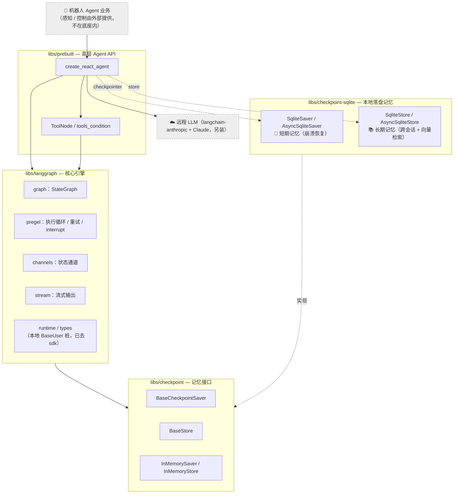
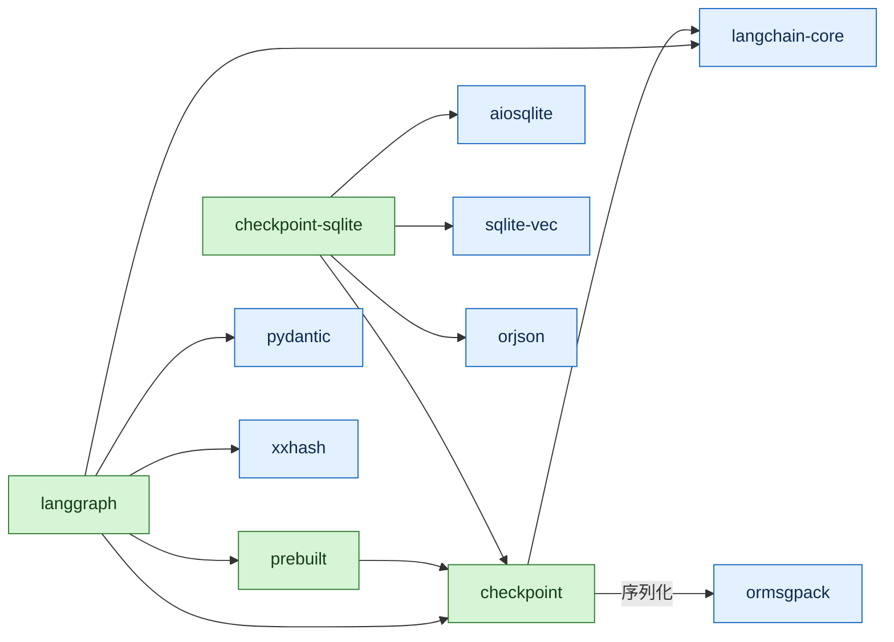
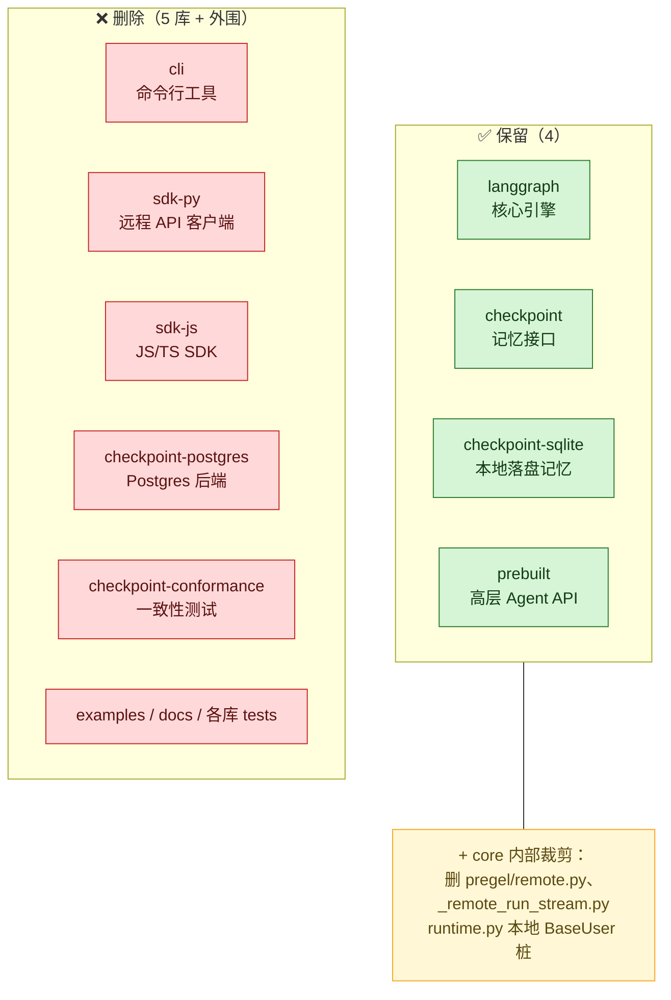
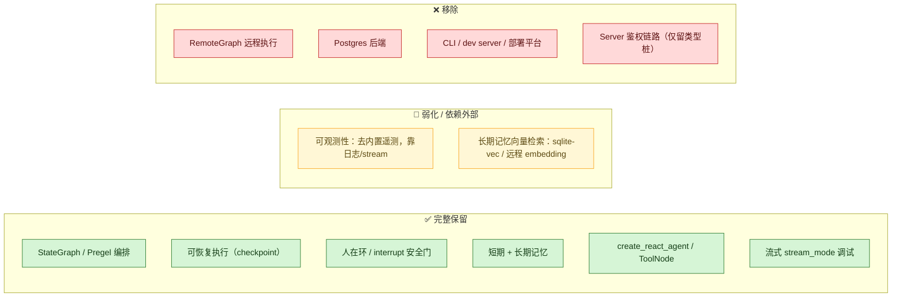

# 项目结构图 & 与原版 LangGraph 对比

本文用 Mermaid 图描述裁剪后「嵌入式机器人 Agent 底座」的结构，并与原版 LangGraph monorepo 做对比。
（在 GitHub / VS Code / 支持 Mermaid 的查看器中可直接渲染。）

---

## 一、当前项目分层结构

**思考 → 决策 → 行动 → 记忆**的闭环：`create_react_agent`（或自定义 `StateGraph`）用远程 LLM 决策，
经 `ToolNode` 调用工具控制机器人，状态由 `SqliteSaver` 落盘（短期、可恢复），
经验/事实写入 `SqliteStore`（长期、跨会话）。

---

## 二、库依赖关系（裁剪后，仅 4 库）

> 注：`httpx` / `requests` 仍经 `langchain-core → langsmith` 传递性带入（轻量）；
> 已无 `langgraph-sdk`（连带 websockets）与 `psycopg`。详见 [SLIMMING_NOTES.md](./SLIMMING_NOTES.md)。

---

## 三、与原版 LangGraph 对比

### 3.1 库层面：保留 vs 删除

### 3.2 对比表

| 维度 | 原版 LangGraph monorepo | 当前底座（裁剪后） |
|------|--------------------------|---------------------|
| Python 库数量 | 8（+1 JS 桩） | **4** |
| 源码体积 | ~13M（含 tests/examples） | **~2.5M**（4 库源码） |
| `langgraph` 运行时依赖 | langchain-core、langgraph-checkpoint、**langgraph-sdk**、langgraph-prebuilt、xxhash、pydantic | langchain-core、langgraph-checkpoint、langgraph-prebuilt、xxhash、pydantic（**去 sdk**） |
| 远程执行 | `RemoteGraph`（remote.py，依赖 sdk + httpx/websockets） | **已移除** |
| 记忆持久化后端 | 内存 / SQLite / **Postgres** | 内存 / **SQLite（本地落盘）** |
| 重量级依赖 | psycopg、websockets、httpx（直接） | **均已去除直接依赖** |
| 服务端 / 部署 | CLI + dev server + Server SDK | **无**（仅本地嵌入式运行） |
| 测试 | 各库庞大单测 + docker compose（pg/redis） | 根 `tests/` 轻量验收套件（22 用例，纯本地） |
| LLM 接入 | 任意（含 Server 链路） | **远程 API 为主**（langchain-anthropic + Claude） |
| 目标场景 | 通用 / 云端 / 多机部署 | **嵌入式 Linux 机器人**：依赖少、可靠、可调试 |

### 3.3 能力对比（保留 / 弱化 / 移除）

